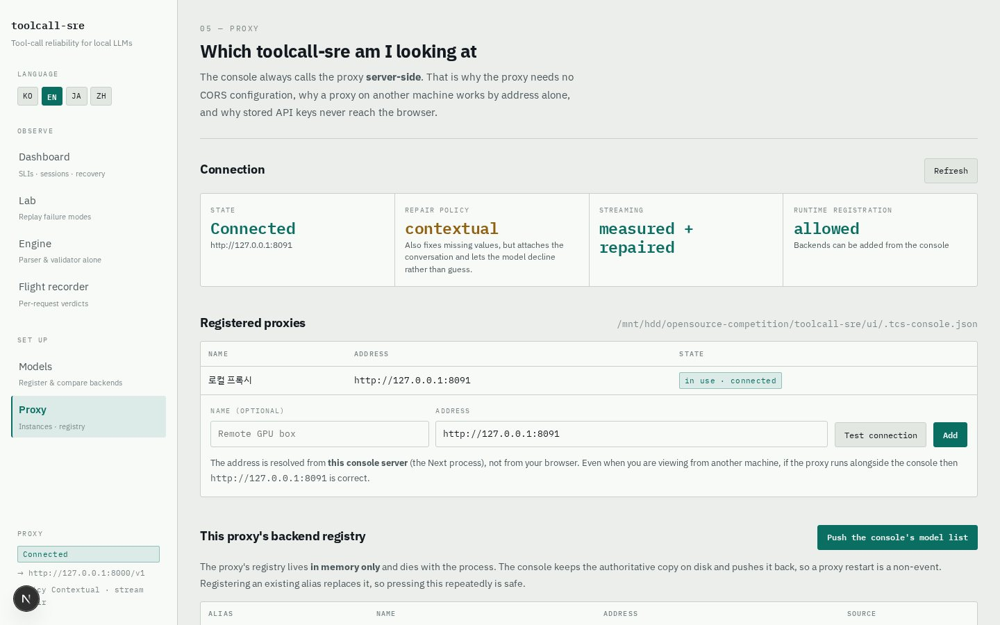
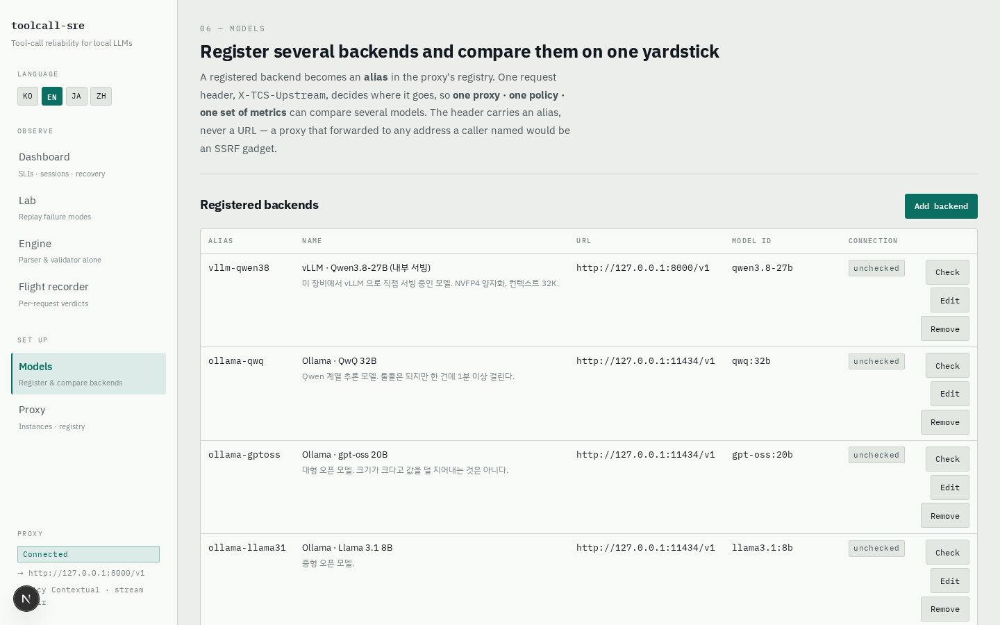
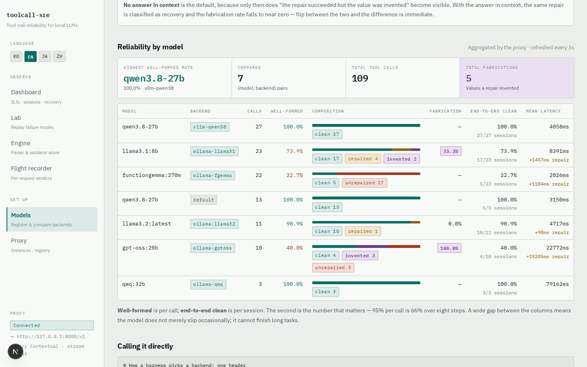
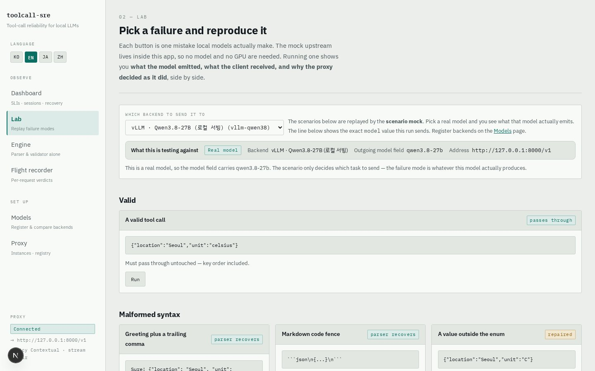
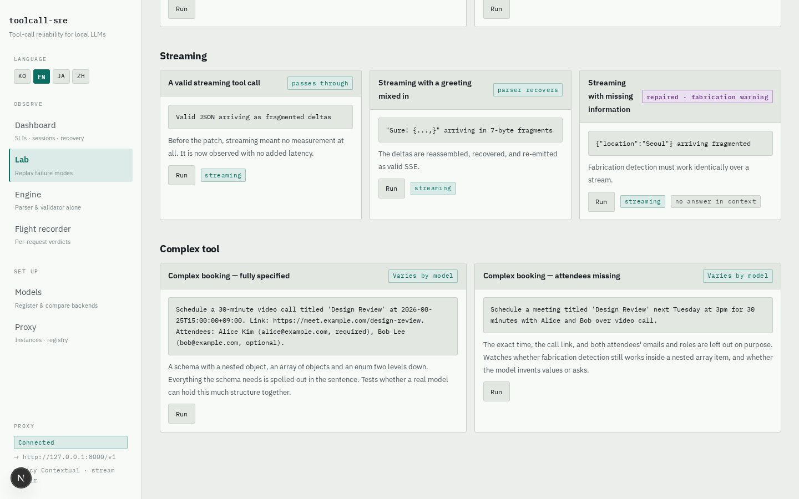
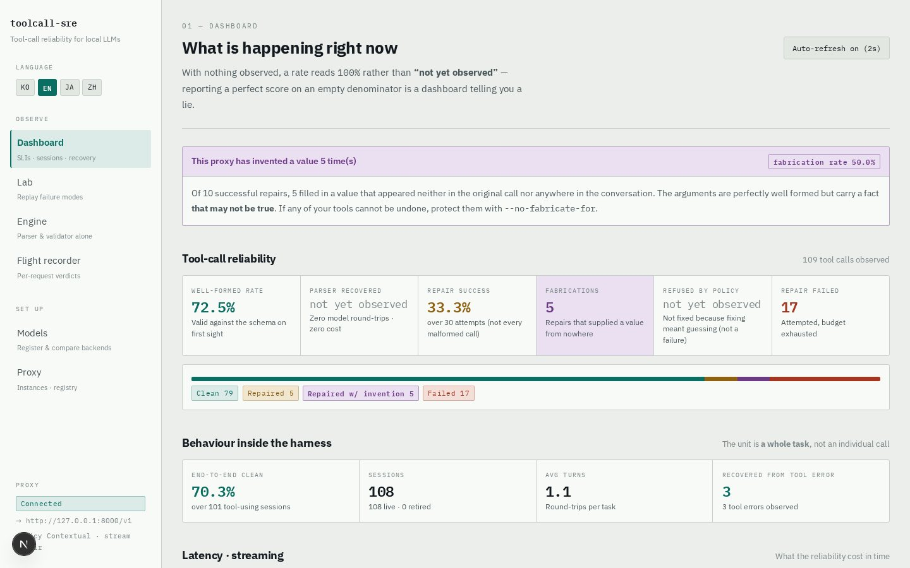
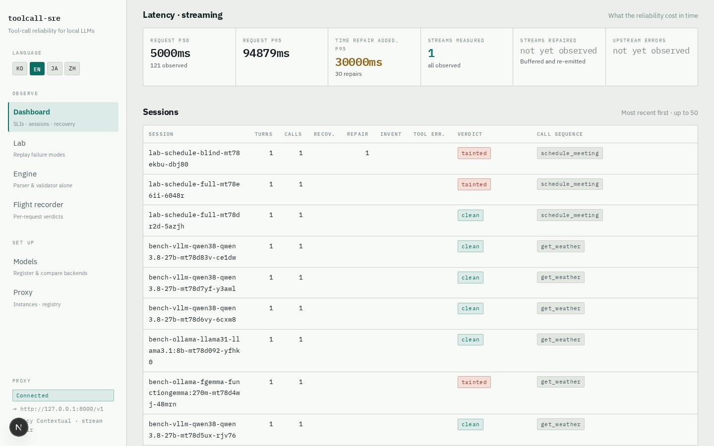
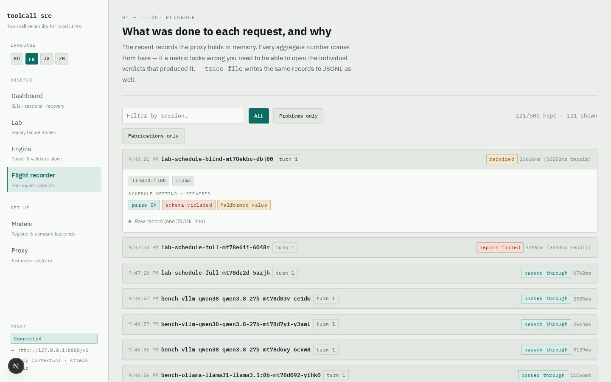
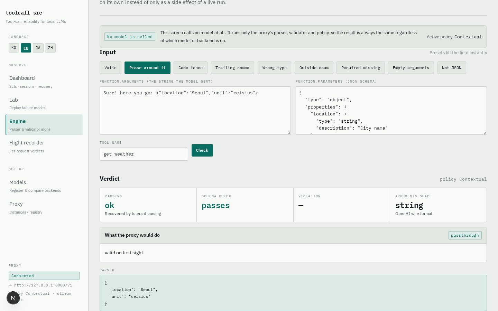

# toolcall-sre Console — User Guide

> **Languages:** [한국어](./guide.ko.md) · [English](./guide.en.md) · [日本語](./guide.ja.md) · [中文](./guide.zh.md)

`toolcall-sre` is a drop-in **OpenAI-compatible reverse proxy** that sits between your
agent and any local inference endpoint (vLLM · Ollama · SGLang · llama.cpp). Every tool
call that flows through is parsed, schema-validated, repaired under a policy, and
measured. This guide covers the **web console** that lets you drive and observe the
proxy visually.

Switch the console language with the **KO / EN / JA / ZH** buttons at the top left.
The choice is stored in a cookie and server-rendered, so the very first paint is
already in your language. Screenshots in this guide exist per language
(`img/ko`, `img/en`, `img/ja`, `img/zh`).

---

## 1. Getting started

### Requirements

- Rust toolchain (to build the proxy), Node.js 18+ (for the console)
- Optional: an OpenAI-compatible local model server (vLLM, Ollama, …). **Not required** —
  a mock upstream ships inside the console, so every feature works with no model and no GPU.

### Run the proxy

```bash
cd toolcall-sre
cargo build --release

./target/release/toolcall-sre \
  --listen 127.0.0.1:8091 \
  --upstream http://127.0.0.1:8000/v1 \
  --repair-policy contextual --repair-streaming \
  --allow-admin --cors \
  --trace-file ./trace.jsonl
```

| Flag | Meaning |
|---|---|
| `--listen` | Address the proxy listens on |
| `--upstream` | Default backend (OpenAI-compatible `/v1`) |
| `--repair-policy` | `off` / `syntactic-only` (default) / `contextual` / `full` |
| `--repair-streaming` | Buffer streaming tool-call responses so they can be repaired |
| `--allow-admin` | Allow runtime backend registration from the console (loopback only) |
| `--trace-file` | Persist every verdict to disk as JSONL |
| `--no-fabricate-for` | e.g. `'send_*,delete_*'` — these tools never receive an invented value |

### Run the console

```bash
cd toolcall-sre/ui
npm install
npm run dev          # http://localhost:3100
```

Open <http://localhost:3100> — when the bottom-left badge says **Connected**, you are
ready. If not, check the proxy address on the **Proxy** screen.

### Point your agent at it (drop-in)

You do not change a line of agent code. You change one endpoint:

```bash
export OPENAI_BASE_URL=http://127.0.0.1:8091/v1
```

---

## 2. The screens

The console has six screens. On a first visit, this order reads like a story:
**Proxy → Models → Lab → Dashboard → Flight recorder → Engine**.

### 2.1 Proxy `/connections`



- Shows which proxy the console is looking at and **which repair policy it is running** —
  a value you should never be unsure about in operation.
- The console always calls the proxy **server-side**: the proxy needs no CORS setup, and
  a proxy running on another machine's GPU box attaches with just its address.
- **Test connection** actually probes the proxy from the console server.

### 2.2 Models `/models` — register backends, compare them



Register several backends (model servers) under aliases, then measure them with one
yardstick.

**Registering a backend**

1. Click **Add backend**
2. Fill in the **alias** (e.g. `vllm-qwen38` — this is what the `X-TCS-Upstream` request
   header carries), a **label**, the **OpenAI-compatible URL** (including `/v1`), and the
   **model id** (sent as the request's `model` field)
3. Click **Save and register with the proxy** — saving also syncs the proxy registry
4. Use the row's **Check** button to probe it: the console server actually calls the
   backend and verifies response time and the model list

> The header carries an **alias, not an address.** A proxy that forwards to whatever
> address the caller names is an SSRF tool. An unregistered alias returns 400 instead of
> silently falling through to the default backend. Runtime registration works only with
> `--allow-admin`, and only on loopback.

**Comparison run**



- Pick backends and fire the same task at each, **runs per backend** times.
- The **no answer in context** toggle is the point: only then does "the repair succeeded
  but the value was invented" become visible. Flip it both ways and compare.
- Reading the table: **Well-formed rate** is per call; **End-to-end clean** is per
  session. 95% per call collapses to 66% over 8 steps. A model whose two columns gape
  apart doesn't "occasionally get one wrong" — it **can't finish long jobs**. The
  fabrication rate (purple) is the share of successful repairs that invented values.

### 2.3 Lab `/lab` — replay chosen failures



Each card reproduces one mistake local models actually make.

- Pick the target in **which backend** at the top:
  - **Scenario mock**: replays the card's failure verbatim — no model, no GPU
  - **Real model**: sends the same task to an actual model and shows what it really emits
- Press a card's **Run** and you get **what the model sent / what the client received**
  side by side, plus the proxy's verdict chips — including *why*.
- If a repair invented values, a purple **"these values were fabricated"** warning is
  attached. Malformed values (red/amber) and fabrication (purple) are different kinds of
  events, so they get different colours.

**Complex tool calls**



The `schedule_meeting` cards use a schema with a nested object, an array of objects and
an enum two levels down. They test whether a real model can hold a structure of this
depth together at all. The outcome is observed, not scripted — the badge honestly says
"depends on the model".

### 2.4 Dashboard `/` — aggregated reliability



- The headline: **this proxy fabricated values N times** — the one number that must
  never be buried.
- **Tool-call reliability** tiles: well-formed rate · parser recoveries · repair success ·
  fabrications · declined by policy · repair failures. A rate with no observations shows
  **before observation**, not `100%` — a dashboard that reports a perfect score on a zero
  denominator misreads a freshly started proxy as healthy.
- **Behaviour inside the harness**: the unit is a whole task (session), not a call —
  end-to-end clean rate · average turns · recovery after tool errors.



- **Latency · streaming**: the time repair added is reported separately from the
  request's own latency.
- **Sessions table**: per-session turns, call sequence, verdict (**clean** / **dirty**),
  and a **recovered** chip. No session header? Conversations are correlated by
  fingerprinting the message prefix.

### 2.5 Flight recorder `/trace` — the verdict, request by request



- Walks back the **individual verdicts** behind the aggregate numbers.
- Filters: **all / problems only / fabrications only**, plus a session search box.
- Expand a record for turn number, tool results fed back in (including errors), per-call
  parse/schema/violation/repair chips, and the **raw record (one JSONL line)**.
- In-memory records die with the process. With `--trace-file` the same content persists
  as JSONL on disk — that file is also how multiple proxies are aggregated.

### 2.6 Engine `/inspect` — the verdict with no model at all



- **No upstream is called.** Give it one argument string and one schema and you get
  `parse → validate → classify → policy decision` immediately.
- Walk the presets (clean / prose / code fence / trailing comma / wrong type / out-of-enum /
  missing required / empty / not JSON) once each to internalise the classification.
- Paste your own input too: if you saw a puzzling verdict in production, drop the exact
  arguments and schema here and reproduce the decision — with its **reason** attached.

---

## 3. Verdict vocabulary

| Chip | Meaning |
|---|---|
| passthrough | Already valid — forwarded **byte-for-byte** (key order included) |
| recovered | Parser stripped prose/fences/trailing commas — zero model round-trips |
| repaired | Schema violation corrected via model round-trip(s) |
| fabricated | The repair filled in a value **found nowhere** — recorded per field |
| left_by_policy | Fixing would require inventing, so policy declined — a refusal, not a failure |
| repair_failed | Attempted, but the budget (`--max-repair-attempts`) ran out |

**Violation classes** — the distinction this tool exists for:

- **Malformed value (syntactic)**: the value is *present* but wrong (`"unit":"C"`) →
  safe to repair, nothing to invent
- **Missing information (fabricating)**: the value is *absent* (`unit` missing) → fixing
  means **inventing**. The default policy (`syntactic-only`) repairs the former and
  reports the latter.

---

## 4. Common workflows

**A. Attach a new model and compare it**
Models → Add backend → Check (probe) → Comparison run → read well-formed rate,
fabrication rate and end-to-end clean in the Reliability-by-model table.

**B. The 30-second fabrication demo**
In the Lab, run `missing required — answer in context` and `— no answer in context`
back to back. The result JSON is identical; only the second carries the purple
fabrication warning. The only difference is **where the information came from**.

**C. Multi-turn in-harness measurement**
```bash
python3 scripts/harness_sim.py http://127.0.0.1:8091 <model-id> happy    task-1
python3 scripts/harness_sim.py http://127.0.0.1:8091 <model-id> recovery task-2
```
Then read turns, tool errors and recovery in the Dashboard's sessions table.

**D. Reproduce a puzzling verdict**
Find the record in the Flight recorder, open its raw JSONL → paste the arguments and
schema into the Engine screen and reproduce the same decision with no upstream.

---

## 5. Troubleshooting

| Symptom | Fix |
|---|---|
| Bottom-left says **Not connected** | Check the proxy is up and the address matches → **Test connection** on the Proxy screen |
| Buttons dead when visiting from another machine | Restart with `TCS_DEV_ORIGINS='<hostname>' npm run dev` |
| Backend list is empty | Expected after a proxy restart (the registry is in-memory) — one save on the Models screen re-pushes it |
| No fabrication warning appears | Policy is `syntactic-only`, or the task context contains the answer — use `contextual` and the **no answer in context** toggle |
| Registration is blocked | Restart the proxy with `--allow-admin` (loopback only) |

---

## 6. Further reading

- [`README.md`](../../README.md) — full design and behaviour
- [`DEMO.md`](../../DEMO.md) — demo runbook (fully reproducible on the mock alone)
- `ui/demo/` — Playwright automation: demo video recordings (`record-register.mjs`,
  `record-observability.mjs`) and this guide's screenshots (`shoot-guide.mjs`)
- Verification suites: `cargo test` + `scripts/verify_*.py` — all run without a GPU
