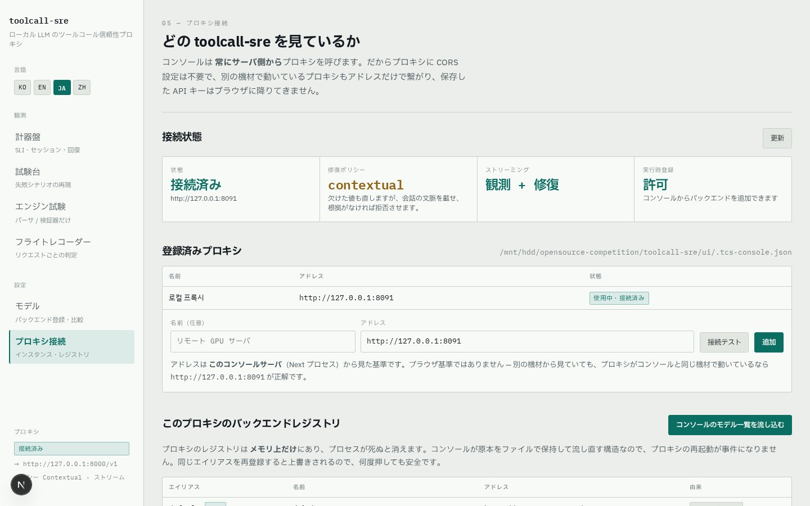
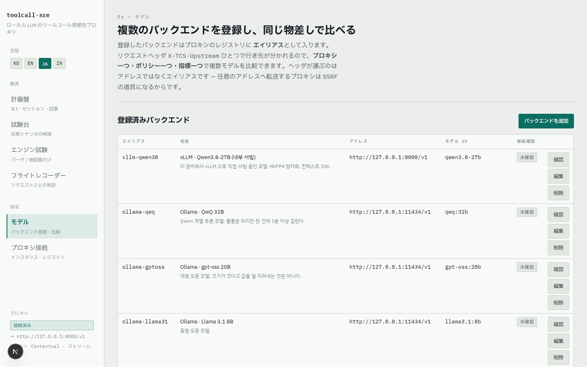
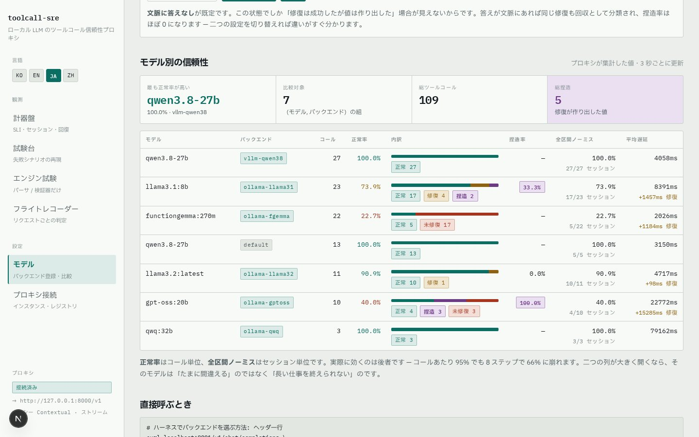
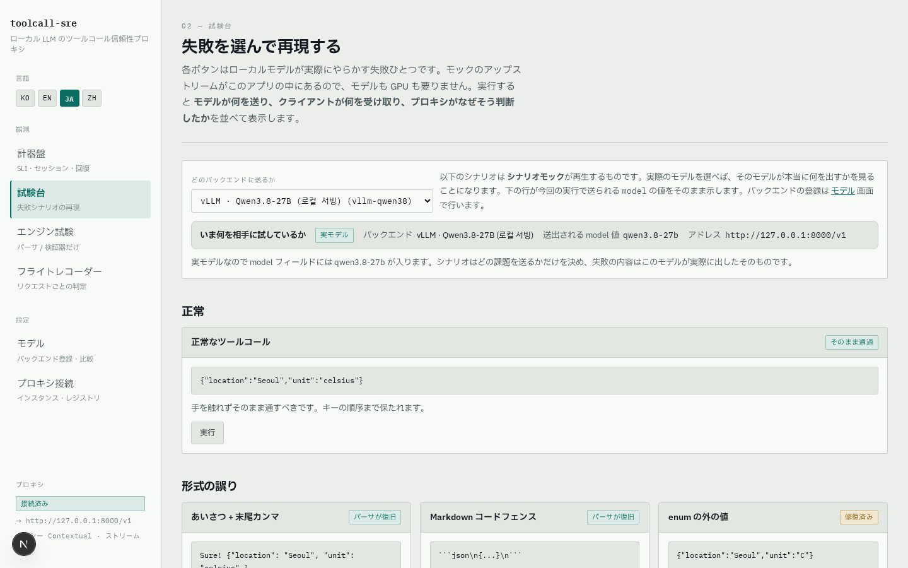
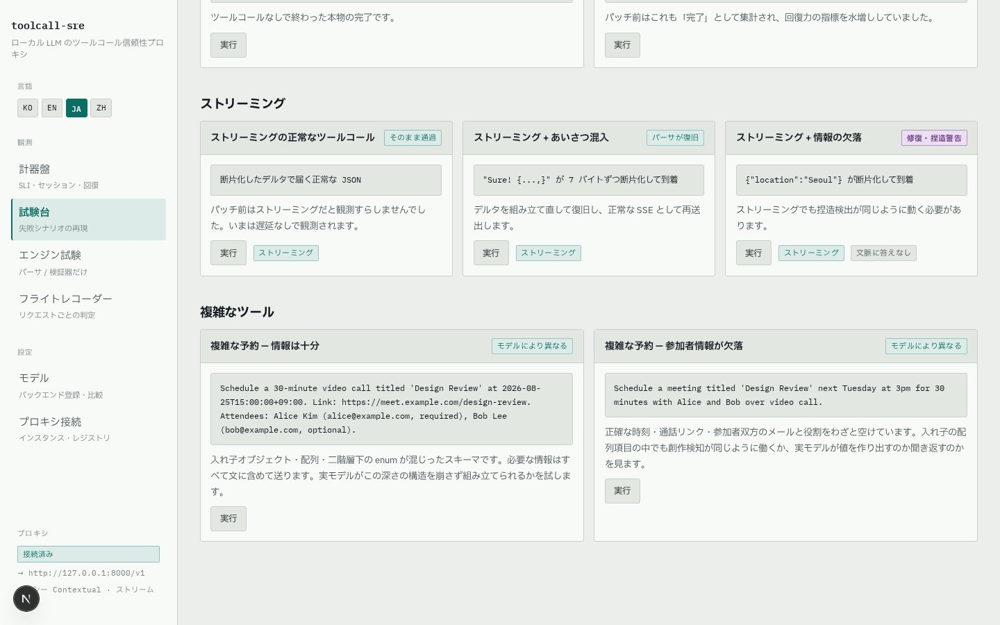
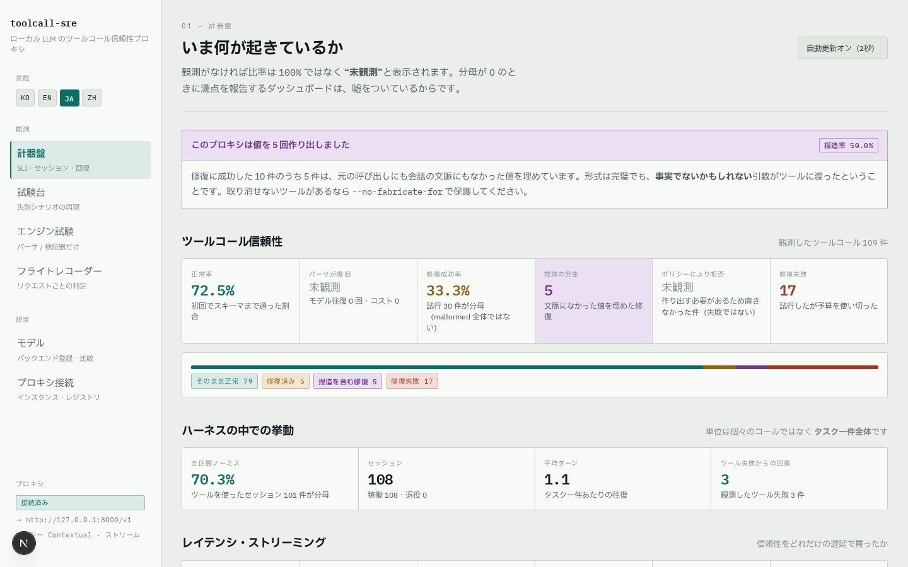
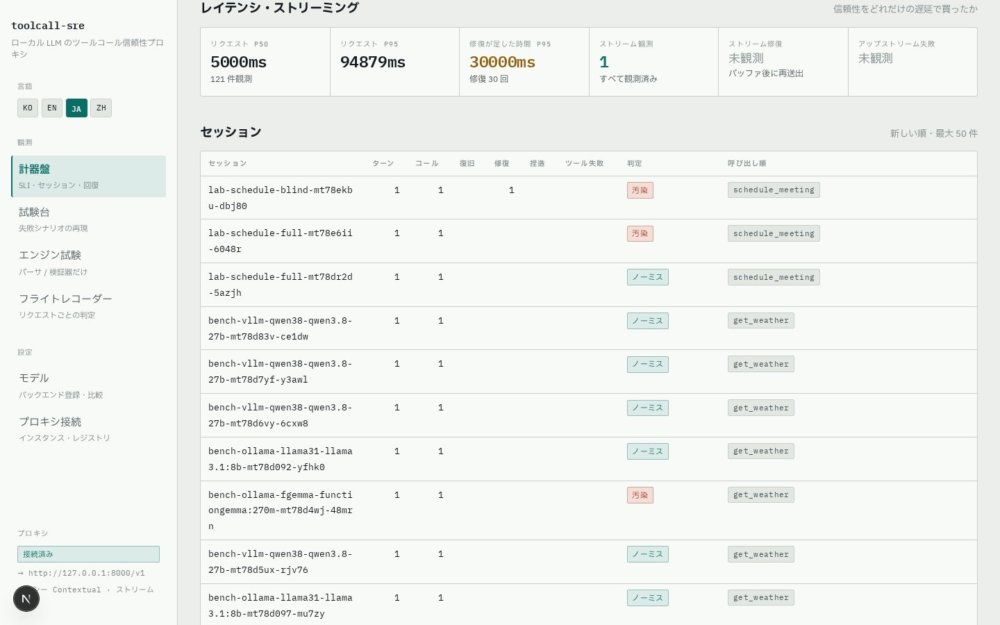
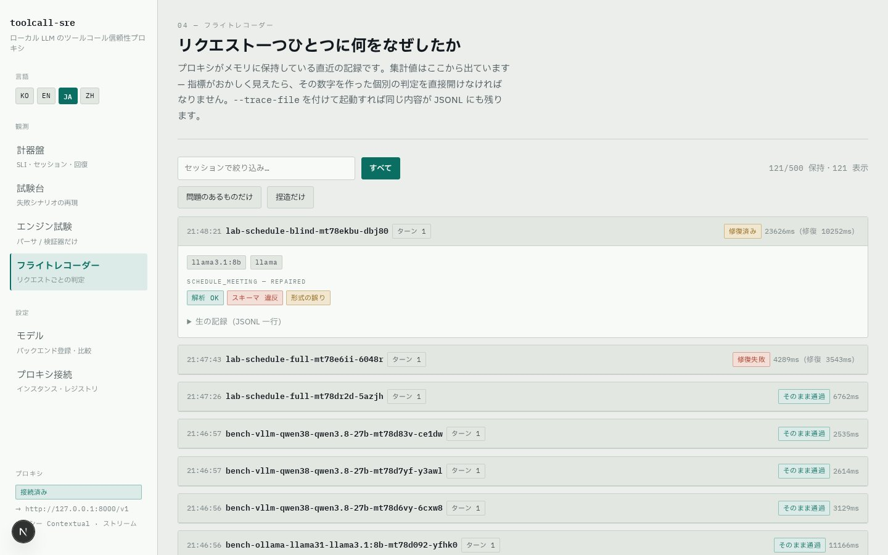
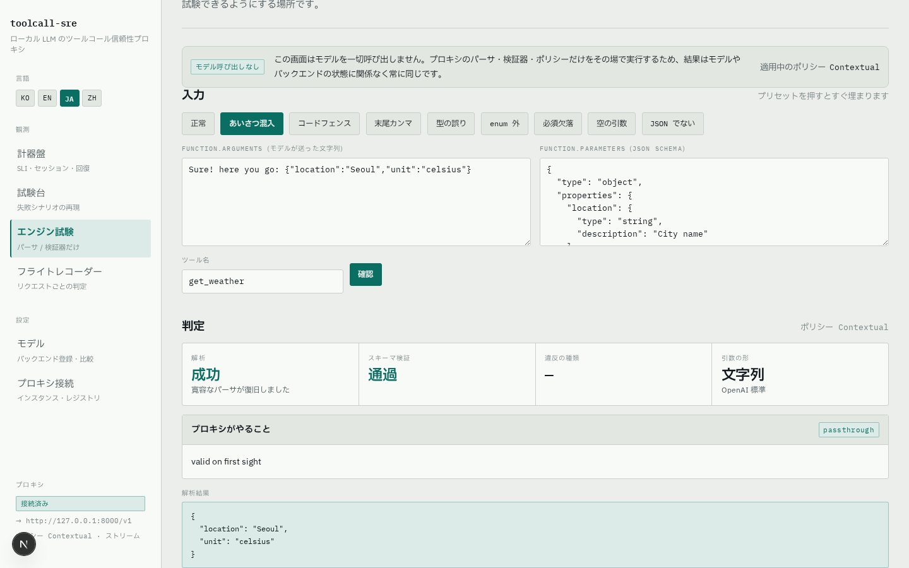

# toolcall-sre コンソール ユーザーガイド

> **Languages:** [한국어](./guide.ko.md) · [English](./guide.en.md) · [日本語](./guide.ja.md) · [中文](./guide.zh.md)

`toolcall-sre` は、エージェントとローカル推論エンドポイント(vLLM · Ollama · SGLang ·
llama.cpp)の間に挟む **OpenAI 互換リバースプロキシ**です。通過するすべてのツールコール
(function calling)を、パース → スキーマ検証 → ポリシーに基づく修復 → 計測します。
本ガイドは、そのプロキシを目で操作・観測できる **Web コンソール**の使い方を扱います。

コンソールの言語は左上の **KO / EN / JA / ZH** ボタンで切り替えられます。選択は Cookie に
保存されサーバーレンダリングされるため、最初の描画から選んだ言語で表示されます。本ガイドの
スクリーンショットも言語別に用意しています(`img/ko`, `img/en`, `img/ja`, `img/zh`)。

---

## 1. はじめる

### 必要なもの

- Rust ツールチェーン(プロキシのビルド)、Node.js 18+(コンソール)
- 任意: OpenAI 互換のローカルモデルサーバー(vLLM、Ollama など)。**無くても動きます** —
  モックのアップストリームがコンソールに同梱されており、モデルも GPU も無しで全機能を試せます。

### プロキシの起動

```bash
cd toolcall-sre
cargo build --release

./target/release/toolcall-sre \
  --listen 127.0.0.1:8091 \
  --upstream http://127.0.0.1:8000/v1 \
  --repair-policy contextual --repair-streaming \
  --allow-admin --cors \
  --trace-file ./trace.jsonl
```

| フラグ | 意味 |
|---|---|
| `--listen` | プロキシの待ち受けアドレス |
| `--upstream` | 既定のバックエンド(OpenAI 互換 `/v1`) |
| `--repair-policy` | `off` / `syntactic-only`(既定) / `contextual` / `full` |
| `--repair-streaming` | ストリーミングのツールコール応答もバッファして修復 |
| `--allow-admin` | コンソールからのバックエンド実行時登録を許可(ループバック限定) |
| `--trace-file` | すべての判定を JSONL としてディスクに保存 |
| `--no-fabricate-for` | 例: `'send_*,delete_*'` — 指定ツールには捏造値を決して渡さない |

### コンソールの起動

```bash
cd toolcall-sre/ui
npm install
npm run dev          # http://localhost:3100
```

ブラウザで <http://localhost:3100> を開き、左下のバッジが **接続済み** なら準備完了です。
繋がらない場合は **プロキシ接続** 画面でプロキシのアドレスを確認してください。

### エージェントを向ける(ドロップイン)

エージェントのコードは一行も変えません。エンドポイントだけを変えます。

```bash
export OPENAI_BASE_URL=http://127.0.0.1:8091/v1
```

---

## 2. 画面ガイド

コンソールは 6 画面です。初めてなら **プロキシ接続 → モデル → 試験台 → 計器盤 →
フライトレコーダー → エンジン試験** の順に読むと物語として繋がります。

### 2.1 プロキシ接続 `/connections`



- コンソールがどのプロキシを見ているか、そのプロキシが**どの修復ポリシーで動いているか**を
  表示します — 運用中に不明であってはならない値です。
- コンソールはプロキシを**常にサーバーサイドから**呼びます。プロキシ側の CORS 設定は不要で、
  別マシンの GPU サーバー上のプロキシもアドレスを入れるだけで繋がります。
- **接続テスト** はコンソールサーバーから実際にプロキシを叩いて確認します。

### 2.2 モデル `/models` — バックエンドの登録と比較



複数のバックエンド(モデルサーバー)をエイリアスで登録し、同じ物差しで比較する画面です。

**バックエンドの登録手順**

1. **バックエンドを追加** をクリック
2. **エイリアス**(例: `vllm-qwen38` — リクエストヘッダー `X-TCS-Upstream` に載る値)、
   **名前**、**OpenAI 互換 URL**(`/v1` を含む)、**モデル id**(リクエストの `model`
   フィールドとして送られる)を入力
3. **保存してプロキシに登録** — 保存と同時にプロキシのレジストリへ同期されます
4. 行の **確認** ボタンで疎通確認 — コンソールサーバーがバックエンドを実際に呼び、
   応答時間とモデル一覧を検証します

> ヘッダーが運ぶのは**アドレスではなくエイリアス**です。呼び出し側が指定した任意の
> アドレスへ転送するプロキシは SSRF の道具になるからです。未登録のエイリアスは既定
> バックエンドへ黙って流れず 400 を返します。実行時登録は `--allow-admin` かつ
> ループバックでのみ有効です。

**比較実行**



- バックエンドを選び、**バックエンドごとの回数**だけ同じ課題を投げます。
- **文脈に答えなし** トグルが要点です。この状態でしか「修復は成功したが値は作り出した」
  ケースが見えません。両方の設定で回して比べてください。
- 表の読み方: **正常率**はコール単位、**全区間ノーミス**はセッション単位です。コールあたり
  95% でも 8 ステップで 66% に崩れます。二つの列が大きく開くモデルは「たまに間違える」の
  ではなく **「長い仕事を終えられない」** のです。捏造率(紫)は成功した修復のうち値を
  作り出した割合です。

### 2.3 試験台 `/lab` — 失敗を選んで再現



ローカルモデルが実際に犯すミスを、カード一枚につき一つずつ再現します。

- 上部の **どのバックエンドへ送るか** で対象を選びます。
  - **シナリオモック**: カードが説明する失敗を台本どおり再生 — モデルも GPU も不要
  - **実モデル**: 同じ課題を本物のモデルに投げ、実際に出てくるものを観測
- カードの **実行** を押すと、**モデルが送ったもの / クライアントが受け取ったもの** が
  並んで表示され、プロキシの判定(なぜそうしたか)がチップで付きます。
- 修復が値を作り出した場合は、紫の **「これらの値は捏造です」** 警告が付きます。
  形式の誤り(赤・黄)と捏造(紫)は種類の違う事象なので、色を分けています。

**複雑なツールコール**



`schedule_meeting` のカードは、ネストしたオブジェクト・オブジェクト配列・二階層下の
enum が混ざったスキーマです。実モデルがこの深さの構造を崩さずに作れるかを見ます。
結果は台本ではなく観測なので、バッジも正直に「モデルによって異なる」と書いてあります。

### 2.4 計器盤 `/` — 集計された信頼性



- 最上部の見出し: **このプロキシは値を N 回捏造しました** — 決して埋もれてはならない数字。
- **ツールコール信頼性**: 正常率 · パーサー復旧 · 修復成功率 · 捏造の発生 · ポリシーによる
  拒否 · 修復失敗。観測が無い比率は `100%` ではなく **観測前** と表示されます — 分母ゼロで
  満点を報告するダッシュボードは、起動直後を正常と誤読させるからです。
- **ハーネスの中での挙動**: 単位はコールではなく**仕事一件(セッション)**です。
  全区間ノーミス率 · 平均ターン · ツールエラー後の回復。



- **レイテンシ · ストリーミング**: 修復が足した時間を、リクエスト自体の時間と分けて報告します。
- **セッション表**: セッションごとのターン数 · 呼び出し順序 · 判定(**ノーミス** / **汚染**)·
  **回復** チップ。セッションヘッダー(`X-Session-Id`)を送らなくても、会話プレフィックスを
  指紋として相関させます。

### 2.5 フライトレコーダー `/trace` — リクエスト単位の判定記録



- 集計値を作った**個々の判定**をリクエスト単位で遡る画面です。
- フィルタ: **すべて / 問題のあるものだけ / 捏造だけ** + セッション名検索。
- 記録を開くと、ターン番号、戻されたツール結果(エラー含む)、コール別のパース/スキーマ/
  違反/修復チップ、そして **生の記録(JSONL 一行)** が見えます。
- メモリ上の記録はプロセスと共に消えます。`--trace-file` を付ければ同じ内容が JSONL で
  ディスクに残ります — 複数プロキシの合算もこのファイルで行います。

### 2.6 エンジン試験 `/inspect` — モデル無しで判定だけ



- **アップストリームを一切呼びません。** 引数文字列一つとスキーマ一つを与えると、
  `パース → 検証 → 分類 → ポリシー判断` が即座に返ります。
- プリセット(正常 / 前置きの混入 / コードフェンス / 末尾カンマ / 型違い / enum 外 /
  必須欠落 / 空引数 / JSON でない)を一通り押すと分類の基準が掴めます。
- 自由入力もできます — 運用中に不可解な判定を見たら、その引数とスキーマをそのまま貼れば
  同じ判定を再現できます。決定には**理由**が付いて返ります。

---

## 3. 判定の用語

| チップ | 意味 |
|---|---|
| そのまま通過 (passthrough) | 既に有効 — **バイト単位でそのまま**転送(キー順も保持) |
| パーサー復旧 (recovered) | 前置き・フェンス・末尾カンマをパーサーが除去 — モデル往復ゼロ |
| 修復 (repaired) | スキーマ違反をモデル往復で訂正 |
| 捏造 (fabricated) | 修復が**どこにも無かった値**を埋めた — フィールド単位で記録 |
| ポリシーで拒否 (left_by_policy) | 直すには捏造が必要なため拒否 — 失敗ではなく拒否 |
| 修復失敗 (repair_failed) | 試みたが予算(`--max-repair-attempts`)を使い切った |

**違反の分類** — このツールの核心となる区別です:

- **形式の誤り(syntactic)**: 値は*あるのに*間違っている(`"unit":"C"`)→ 捏造なしで修復可能
- **情報の欠落(fabricating)**: 値が*無い*(`unit` 不在)→ 直すには**作り出す**しかない。
  既定ポリシー(`syntactic-only`)は前者だけ直し、後者は報告します。

---

## 4. よく使うワークフロー

**A. 新しいモデルを繋いで比較する**
モデル → バックエンドを追加 → 確認(疎通)→ 比較実行 → モデル別の信頼性表で
正常率・捏造率・全区間ノーミスを比較。

**B. 捏造検出の 30 秒デモ**
試験台で「必須項目の欠落 — 文脈に答えあり」と「— 文脈にも答えなし」を続けて実行。
結果の JSON は完全に同じですが、後者にだけ紫の捏造警告が付きます。違いは
**情報がどこから来たか**、それだけです。

**C. マルチターンのハーネス内計測**
```bash
python3 scripts/harness_sim.py http://127.0.0.1:8091 <model-id> happy    task-1
python3 scripts/harness_sim.py http://127.0.0.1:8091 <model-id> recovery task-2
```
計器盤のセッション表で、ターン数・ツールエラー・回復の有無を確認します。

**D. 不可解な判定の再現**
フライトレコーダーで該当記録を探し、生 JSONL を確認 → エンジン試験に引数とスキーマを
貼り付け、アップストリーム無しで同じ判定を再現。

---

## 5. トラブルシューティング

| 症状 | 対応 |
|---|---|
| 左下が **未接続** | プロキシの起動とアドレスを確認 → プロキシ接続画面の **接続テスト** |
| 別マシンからだとボタンが全滅 | `TCS_DEV_ORIGINS='<ホスト名>' npm run dev` で再起動 |
| バックエンド一覧が空 | プロキシ再起動後の正常動作(レジストリはメモリ)— モデル画面で一度保存すればコンソールが再送します |
| 捏造警告が出ない | ポリシーが `syntactic-only`、または課題の文脈に答えがある — `contextual` と **文脈に答えなし** を確認 |
| 登録がブロックされる | プロキシを `--allow-admin` で再起動(ループバック限定) |

---

## 6. さらに読む

- [`README.md`](../../README.md) — 設計と動作の全体
- [`DEMO.md`](../../DEMO.md) — デモ台本(モックだけで全行程を再現可能)
- `ui/demo/` — Playwright 自動化: デモ動画の録画(`record-register.mjs`,
  `record-observability.mjs`)、本ガイドのスクリーンショット撮影(`shoot-guide.mjs`)
- 検証スイート: `cargo test` + `scripts/verify_*.py` — すべて GPU 無しで動きます
