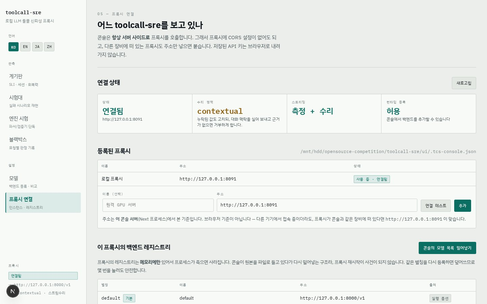
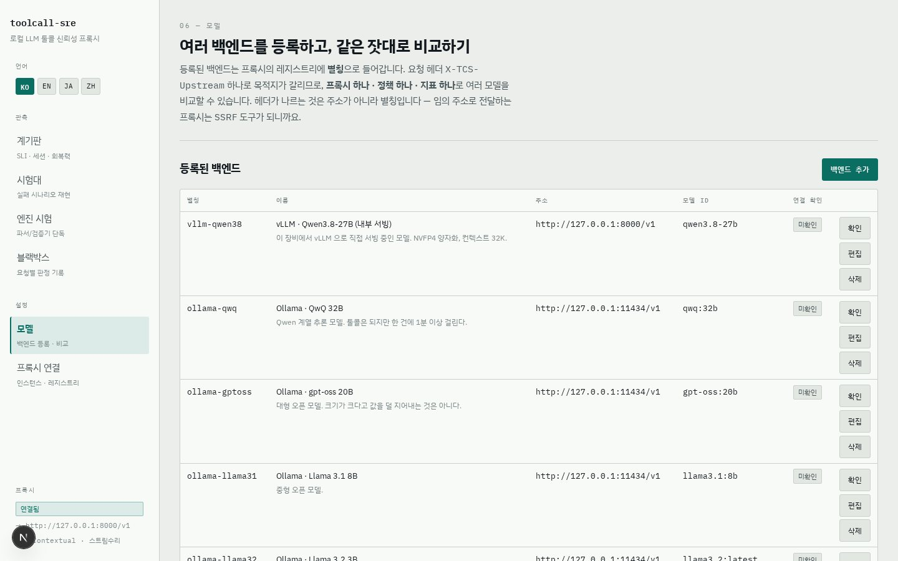
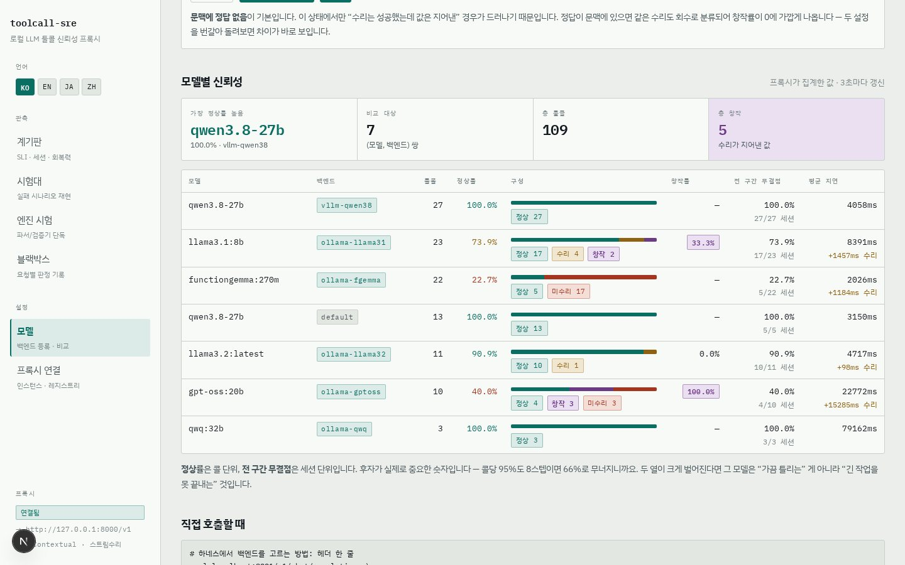
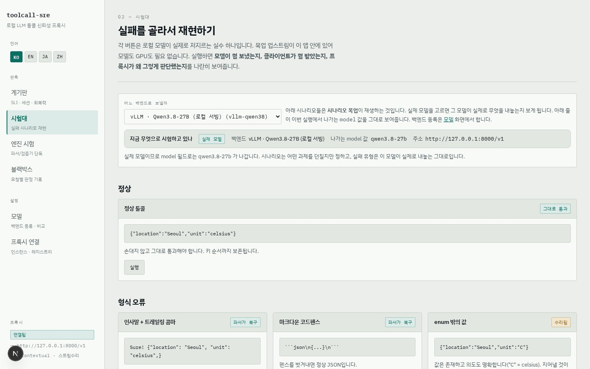
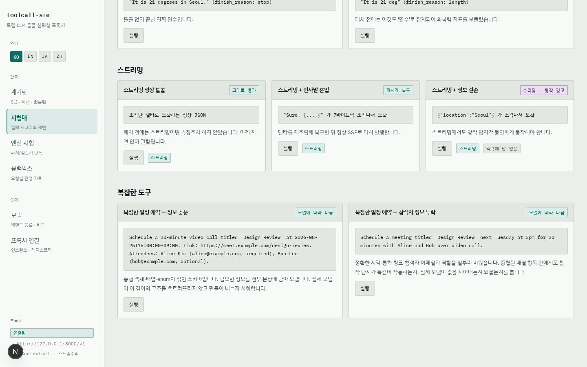
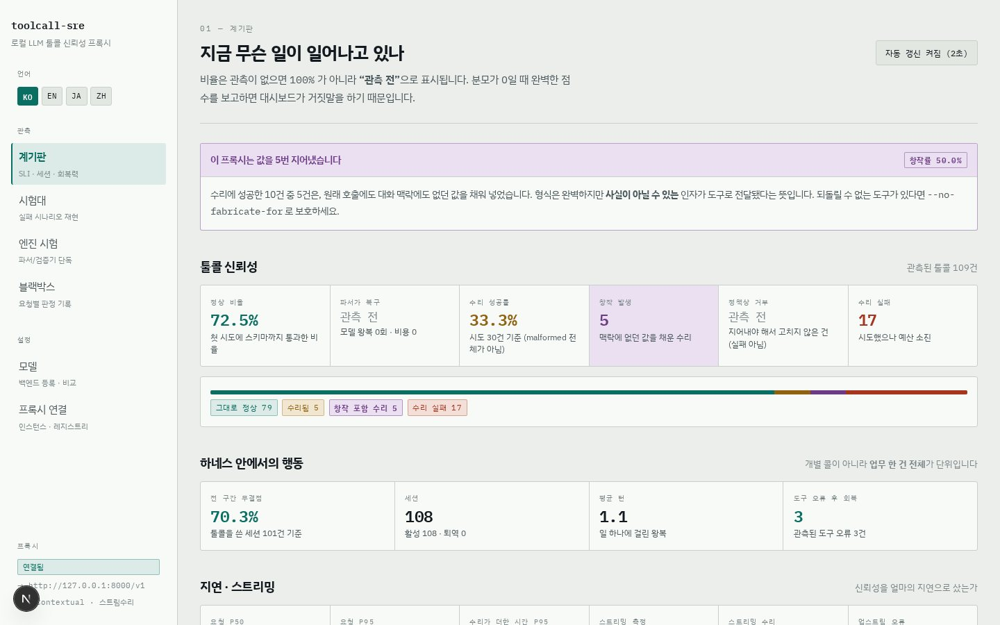
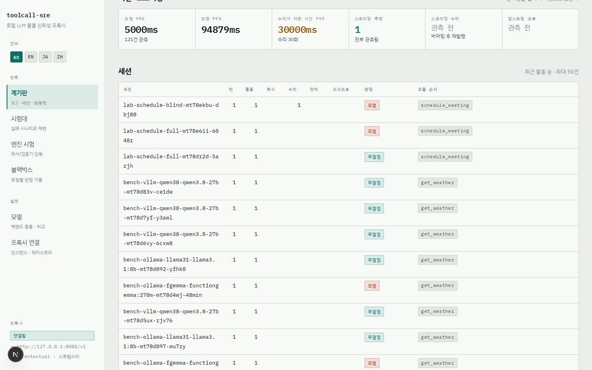
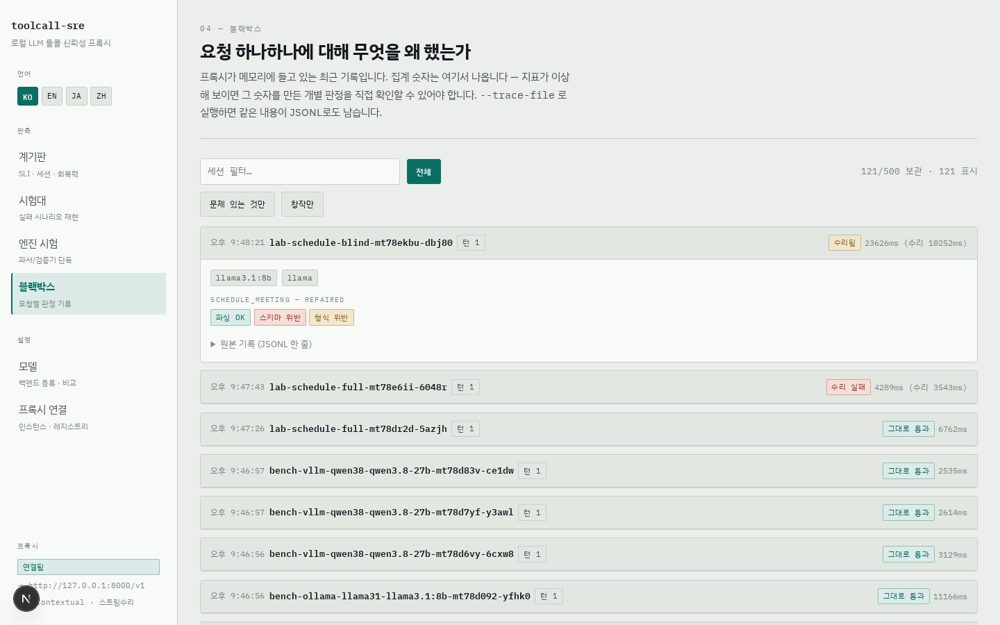
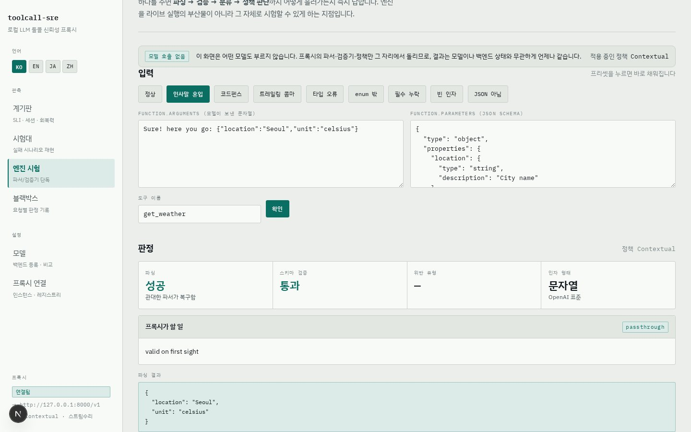

# toolcall-sre 콘솔 사용자 가이드

> **Languages:** [한국어](./guide.ko.md) · [English](./guide.en.md) · [日本語](./guide.ja.md) · [中文](./guide.zh.md)

`toolcall-sre`는 에이전트와 로컬 추론 엔드포인트(vLLM · Ollama · SGLang · llama.cpp) 사이에
끼우는 **OpenAI 호환 리버스 프록시**입니다. 지나가는 모든 툴콜(function calling)을
파싱 → 스키마 검증 → 정책에 따른 수리 → 측정합니다. 이 문서는 그 프록시를 눈으로 조작하는
**웹 콘솔**의 사용법을 다룹니다.

콘솔의 언어는 좌측 상단 **KO / EN / JA / ZH** 버튼으로 바꿀 수 있습니다. 선택은 쿠키에
저장되고 서버에서 렌더되므로 첫 화면부터 선택한 언어로 뜹니다. 이 가이드의 스크린샷도
언어별로 준비되어 있습니다 (`img/ko`, `img/en`, `img/ja`, `img/zh`).

---

## 1. 시작하기

### 요구사항

- Rust 툴체인 (프록시 빌드), Node.js 18+ (콘솔)
- 선택: OpenAI 호환 로컬 모델 서버 (vLLM, Ollama 등). **없어도 됩니다** — 목업
  업스트림이 콘솔 안에 있어 GPU 없이 전 기능을 시험할 수 있습니다.

### 프록시 실행

```bash
cd toolcall-sre
cargo build --release

./target/release/toolcall-sre \
  --listen 127.0.0.1:8091 \
  --upstream http://127.0.0.1:8000/v1 \
  --repair-policy contextual --repair-streaming \
  --allow-admin --cors \
  --trace-file ./trace.jsonl
```

| 플래그 | 의미 |
|---|---|
| `--listen` | 프록시가 듣는 주소 |
| `--upstream` | 기본 백엔드 (OpenAI 호환 `/v1`) |
| `--repair-policy` | `off` / `syntactic-only`(기본) / `contextual` / `full` |
| `--repair-streaming` | 스트리밍 툴콜 응답도 버퍼링해 수리 |
| `--allow-admin` | 콘솔에서 백엔드를 런타임 등록 허용 (루프백 전용) |
| `--trace-file` | 판정 기록을 JSONL로 디스크에 남김 |
| `--no-fabricate-for` | 예: `'send_*,delete_*'` — 지정 도구에는 값 창작 금지 |

### 콘솔 실행

```bash
cd toolcall-sre/ui
npm install
npm run dev          # http://localhost:3100
```

브라우저에서 <http://localhost:3100> 접속 → 좌측 하단이 **연결됨**이면 준비 끝.
안 붙으면 **프록시 연결** 화면에서 프록시 주소를 확인하세요.

### 에이전트 연결 (드롭인)

에이전트 코드는 한 줄도 고치지 않습니다. 엔드포인트만 바꿉니다.

```bash
export OPENAI_BASE_URL=http://127.0.0.1:8091/v1
```

---

## 2. 화면 안내

콘솔은 6개 화면입니다. 처음이라면 **프록시 연결 → 모델 → 시험대 → 계기판 → 블랙박스 →
엔진 시험** 순서가 이야기 흐름대로 읽힙니다.

### 2.1 프록시 연결 `/connections`



- 콘솔이 어느 프록시를 보고 있는지, 그 프록시가 **어떤 수리 정책으로 떠 있는지** 보여줍니다.
- 콘솔은 프록시를 **항상 서버 사이드에서** 호출합니다. 프록시에 CORS 설정이 없어도 되고,
  다른 장비의 GPU 서버에 뜬 프록시도 주소만 넣으면 붙습니다.
- **연결 테스트** 버튼은 콘솔 서버 쪽에서 실제로 프록시를 두드려 확인합니다.

### 2.2 모델 `/models` — 백엔드 등록과 비교



여러 백엔드(모델 서버)를 별칭으로 등록해 두고, 같은 잣대로 비교하는 화면입니다.

**백엔드 등록 절차**

1. **백엔드 추가** 클릭
2. **별칭**(예: `vllm-qwen38` — 요청 헤더 `X-TCS-Upstream`에 실리는 값), **이름**,
   **OpenAI 호환 주소**(`/v1` 포함), **모델 id**(요청의 `model` 필드로 나감) 입력
3. **저장하고 프록시에 등록** — 저장과 동시에 프록시 레지스트리에 동기화됩니다
4. 행의 **확인** 버튼으로 연결 확인 — 콘솔 서버가 백엔드를 실제로 호출해
   응답 시간과 모델 목록을 검증합니다

> 헤더가 나르는 것은 **별칭이지 주소가 아닙니다.** 임의 주소로 전달하는 프록시는 SSRF
> 도구가 되기 때문입니다. 등록 안 된 별칭은 조용히 기본 백엔드로 흘리지 않고 400을 냅니다.
> 런타임 등록은 `--allow-admin`일 때만, 루프백 주소에서만 가능합니다.

**비교 실행**



- 백엔드를 골라 **백엔드당 요청** 횟수만큼 같은 과제를 던집니다.
- **문맥에 정답 없음** 토글이 핵심입니다. 이 상태라야 "수리는 성공했는데 값은 지어낸"
  경우가 드러납니다. 두 설정을 번갈아 돌려보면 차이가 바로 보입니다.
- 표 읽는 법: **정상률**은 콜 단위, **전 구간 무결점**은 세션 단위입니다. 콜당 95%도
  8스텝이면 66%로 무너집니다. 두 열이 크게 벌어진 모델은 "가끔 틀리는" 게 아니라
  **"긴 작업을 못 끝내는"** 모델입니다. **창작률**(보라)은 성공한 수리 중 값을 지어낸 비율입니다.

### 2.3 시험대 `/lab` — 실패를 골라서 재현



로컬 모델이 실제로 저지르는 실수를 카드 하나당 하나씩 재현합니다.

- 상단 **어느 백엔드로 보낼까**에서 대상을 고릅니다.
  - **시나리오 목업**: 카드가 설명하는 실패를 각본대로 재생 — 모델·GPU 불필요
  - **실제 모델**: 같은 과제를 진짜 모델에 던져 그 모델이 실제로 내놓는 것을 관측
- 카드의 **실행**을 누르면 **모델이 보낸 것 / 클라이언트가 받은 것**이 나란히 뜨고,
  프록시의 판정(왜 그렇게 했는지)이 칩으로 붙습니다.
- 수리가 값을 지어냈다면 **"이 값들은 지어낸 것입니다"** 보라색 경고가 붙습니다.
  형식 오류(빨강·노랑)와 창작(보라)은 종류가 다른 사건이라 색을 다르게 씁니다.

**복잡한 도구 호출**



`schedule_meeting` 카드는 중첩 객체 · 배열 · 2단계 enum이 섞인 스키마입니다. 실제 모델이
이 깊이의 구조를 흐트러뜨리지 않고 만들어 내는지를 봅니다. 결과는 각본이 아니라 관측이므로
배지도 "모델에 따라 다름"입니다.

### 2.4 계기판 `/` — 집계된 신뢰성



- 최상단 헤드라인: **이 프록시는 값을 N번 지어냈습니다** — 묻히면 안 되는 숫자 하나.
- **툴콜 신뢰성**: 정상 비율 · 파서가 복구 · 수리 성공률 · 창작 발생 · 정책상 거부 · 수리 실패.
  관측이 없는 비율은 `100%`가 아니라 **관측 전**으로 표시됩니다 — 분모가 0일 때 만점을
  보고하는 대시보드는 기동 직후를 정상으로 오인하게 만들기 때문입니다.
- **하네스 안에서의 행동**: 단위가 콜이 아니라 **업무 한 건(세션)** 입니다.
  전 구간 무결점 · 평균 턴 · 도구 오류 후 회복.



- **지연 · 스트리밍**: 요청 자체의 지연과 **수리가 더한 시간**을 분리해 보고합니다.
- **세션 표**: 세션별 턴 수 · 호출 순서 · 판정(**무결점**/**오염**) · **회복** 칩.
  세션 헤더(`X-Session-Id`)를 안 보내도 대화 프리픽스를 지문 삼아 상관시킵니다.

### 2.5 블랙박스 `/trace` — 요청별 판정 기록



- 집계 숫자를 만든 **개별 판정**을 요청 단위로 되짚는 화면입니다.
- 필터: **전체 / 문제 있는 것만 / 창작만** + 세션 이름 검색.
- 기록을 펼치면 턴 번호, 되먹은 도구 결과(오류 포함), 콜별 파싱·스키마·위반·수리 칩,
  그리고 **원본 기록 (JSONL 한 줄)** 이 나옵니다.
- 메모리 기록은 프로세스가 죽으면 사라집니다. `--trace-file`을 주면 같은 내용이
  디스크에 JSONL로 남습니다 — 프록시 여러 대의 합산도 이 파일로 합니다.

### 2.6 엔진 시험 `/inspect` — 모델 없이 판정만



- **업스트림을 전혀 호출하지 않습니다.** 인자 문자열 하나와 스키마 하나를 주면
  `파싱 → 검증 → 분류 → 정책 판단`이 즉시 나옵니다.
- 프리셋(정상 / 인사말 혼입 / 코드펜스 / 트레일링 콤마 / 타입 오류 / enum 밖 /
  필수 누락 / 빈 인자 / JSON 아님)으로 한 번씩 눌러보면 분류 기준이 잡힙니다.
- 직접 입력도 됩니다 — 운영 중 이상한 판정을 봤다면 그 인자·스키마를 그대로 붙여넣어
  같은 판정을 재현할 수 있습니다. 결정에는 **이유**가 함께 나옵니다.

---

## 3. 판정 용어

| 칩 | 뜻 |
|---|---|
| 그대로 통과 (passthrough) | 이미 유효 — **바이트 단위로 그대로** 전달 (키 순서 포함) |
| 파서가 복구 (recovered) | 프로즈·펜스·트레일링 콤마를 파서가 제거 — 모델 왕복 0회 |
| 수리됨 (repaired) | 스키마 위반을 모델 왕복으로 교정 |
| 창작 (fabricated) | 수리가 **어디에도 없던 값**을 채움 — 필드 단위로 기록 |
| 정책상 거부 (left_by_policy) | 고치려면 지어내야 해서 정책이 거부 — 실패가 아니라 거부 |
| 수리 실패 (repair_failed) | 시도했으나 예산(`--max-repair-attempts`) 소진 |

**위반 분류** — 이 도구의 핵심 구분입니다:

- **형식 위반(syntactic)**: 값은 *있는데* 틀림 (`"unit":"C"`) → 지어낼 것 없이 수리 가능
- **정보 결손(fabricating)**: 값이 *없음* (`unit` 부재) → 고치려면 **지어내야** 함.
  기본 정책(`syntactic-only`)은 전자만 고치고 후자는 신고합니다.

---

## 4. 자주 쓰는 워크플로우

**A. 새 모델을 붙이고 비교하기**
모델 → 백엔드 추가 → 확인(프로브) → 비교 실행 → 모델별 신뢰성 표에서
정상률·창작률·전 구간 무결점 비교.

**B. 창작 탐지 30초 데모**
시험대에서 `필수 항목 누락 — 맥락에 답이 있음`과 `— 맥락에도 답이 없음`을 연달아 실행.
결과 JSON은 완전히 같지만 후자에만 보라색 창작 경고가 붙습니다. 차이는 **정보가 어디서
왔는가** 하나뿐입니다.

**C. 멀티턴 하네스 측정**
```bash
python3 scripts/harness_sim.py http://127.0.0.1:8091 <model-id> happy    task-1
python3 scripts/harness_sim.py http://127.0.0.1:8091 <model-id> recovery task-2
```
계기판의 세션 표에서 턴 수 · 도구 오류 · 회복 여부를 확인합니다.

**D. 이상 판정 재현**
블랙박스에서 문제 기록을 찾아 원본 JSONL을 확인 → 엔진 시험에 인자·스키마를 붙여넣어
업스트림 없이 같은 판정을 재현.

---

## 5. 문제 해결

| 증상 | 대응 |
|---|---|
| 좌측 하단 **연결 안 됨** | 프록시 기동/주소 확인 → 프록시 연결 화면의 **연결 테스트** |
| 다른 기기에서 버튼이 전부 죽음 | `TCS_DEV_ORIGINS='호스트명' npm run dev`로 재기동 |
| 백엔드 목록이 비어 있음 | 프록시 재기동 시 정상 (레지스트리는 메모리) — 모델 화면에서 저장 한 번이면 콘솔이 다시 밀어넣습니다 |
| 창작 경고가 안 뜸 | 정책이 `syntactic-only`거나 과제 문맥에 정답이 있음 — `contextual` + **문맥에 정답 없음** 확인 |
| 등록 화면이 막힘 | 프록시를 `--allow-admin`으로 재기동 (루프백 전용) |

---

## 6. 더 보기

- [`README.md`](../../README.md) — 설계와 동작 원리 전체
- [`DEMO.md`](../../DEMO.md) — 시연 대본 (목업만으로 전 과정 재현 가능)
- `ui/demo/` — Playwright 데모 자동화: 시연 영상 녹화(`record-register.mjs`,
  `record-observability.mjs`), 이 가이드의 스크린샷 캡처(`shoot-guide.mjs`)
- 검증 스위트: `cargo test` + `scripts/verify_*.py` — 전부 GPU 없이 돌아갑니다
