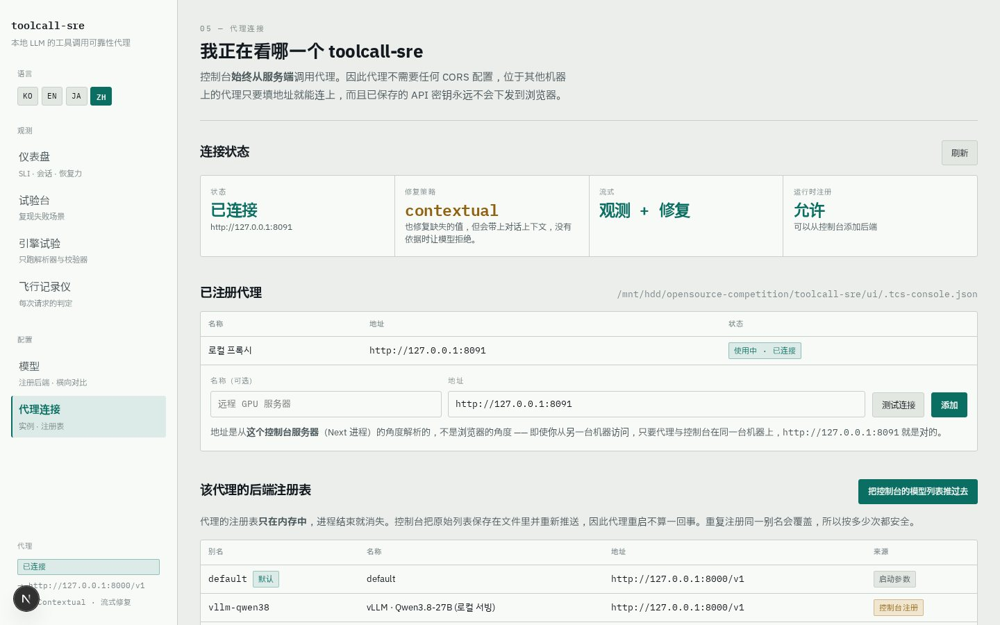
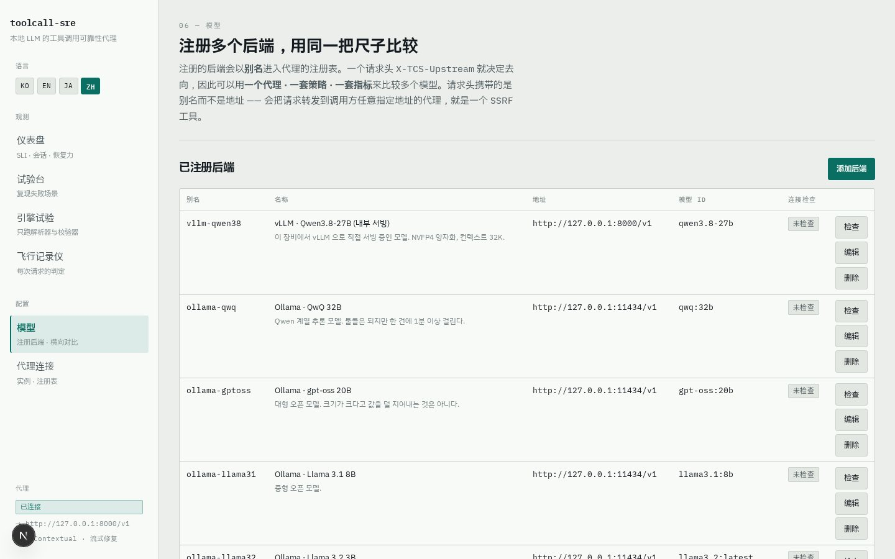
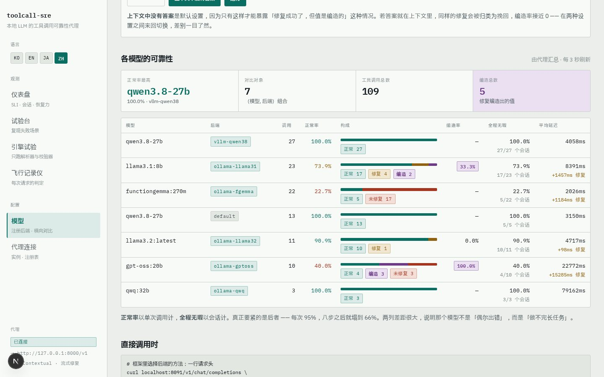
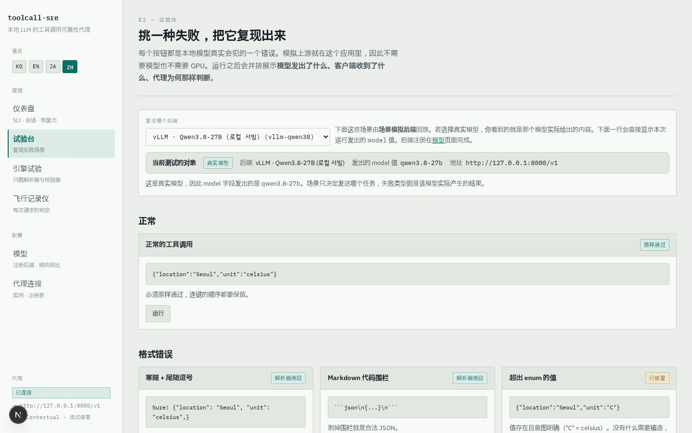
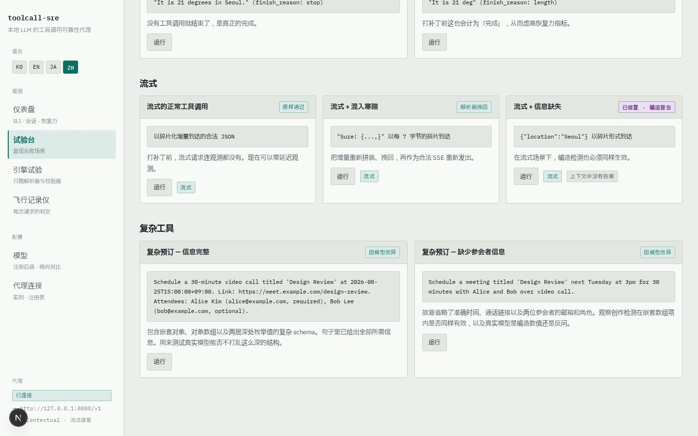
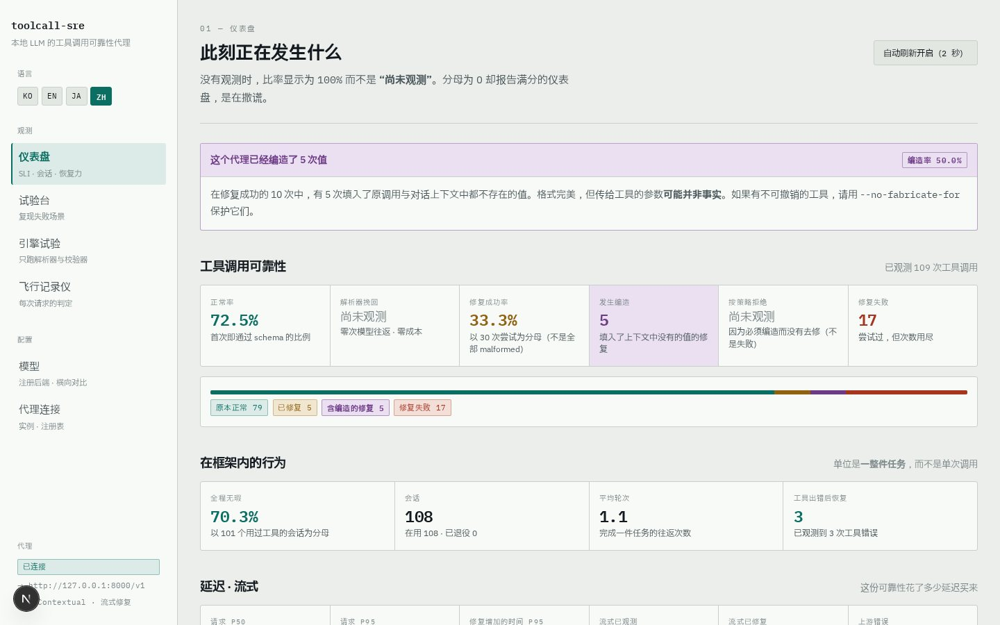
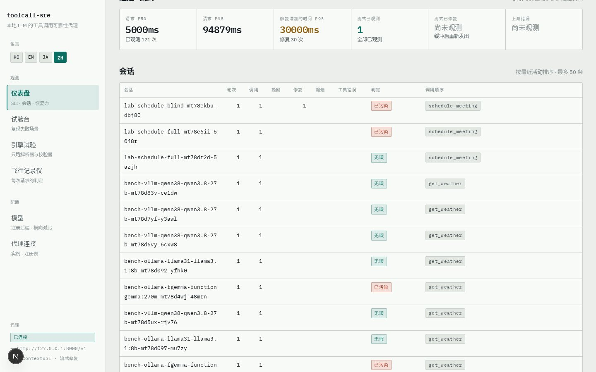
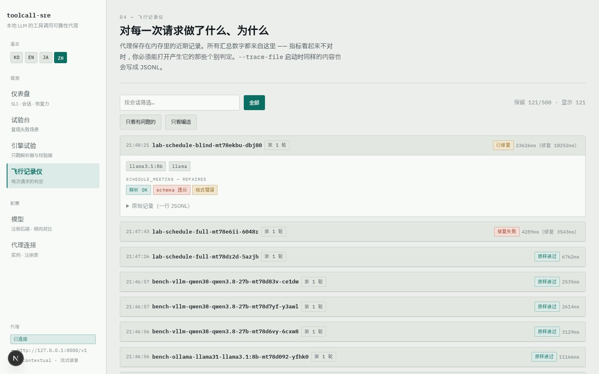
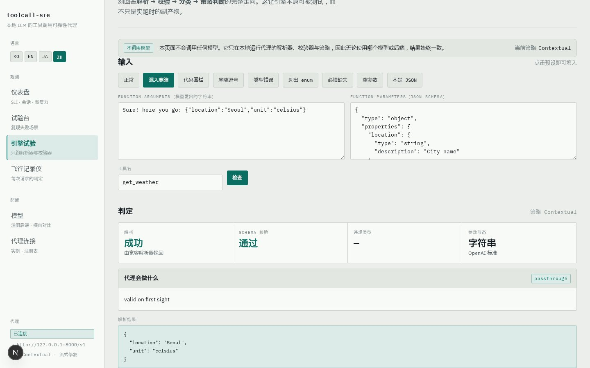

# toolcall-sre 控制台用户指南

> **Languages:** [한국어](./guide.ko.md) · [English](./guide.en.md) · [日本語](./guide.ja.md) · [中文](./guide.zh.md)

`toolcall-sre` 是一个可直接接入的 **OpenAI 兼容反向代理**，位于智能体(agent)与本地推理
端点(vLLM · Ollama · SGLang · llama.cpp)之间。所有经过的工具调用(function calling)
都会被解析 → 按 JSON Schema 校验 → 按策略修复 → 计量。本指南介绍用于可视化操作与观测
该代理的 **Web 控制台**。

控制台语言可用左上角的 **KO / EN / JA / ZH** 按钮切换。选择保存在 Cookie 中并由服务端
渲染，因此首屏即为所选语言。本指南的截图也按语言分别提供
(`img/ko`、`img/en`、`img/ja`、`img/zh`)。

---

## 1. 快速开始

### 前置条件

- Rust 工具链(构建代理)、Node.js 18+(控制台)
- 可选:OpenAI 兼容的本地模型服务(vLLM、Ollama 等)。**没有也可以** —
  控制台内置了模拟上游,无模型、无 GPU 也能体验全部功能。

### 启动代理

```bash
cd toolcall-sre
cargo build --release

./target/release/toolcall-sre \
  --listen 127.0.0.1:8091 \
  --upstream http://127.0.0.1:8000/v1 \
  --repair-policy contextual --repair-streaming \
  --allow-admin --cors \
  --trace-file ./trace.jsonl
```

| 参数 | 含义 |
|---|---|
| `--listen` | 代理监听地址 |
| `--upstream` | 默认后端(OpenAI 兼容 `/v1`) |
| `--repair-policy` | `off` / `syntactic-only`(默认) / `contextual` / `full` |
| `--repair-streaming` | 对流式工具调用响应也进行缓冲与修复 |
| `--allow-admin` | 允许从控制台在运行时注册后端(仅限回环地址) |
| `--trace-file` | 将每一条判定以 JSONL 形式持久化到磁盘 |
| `--no-fabricate-for` | 例:`'send_*,delete_*'` — 这些工具永远不会收到编造的值 |

### 启动控制台

```bash
cd toolcall-sre/ui
npm install
npm run dev          # http://localhost:3100
```

浏览器打开 <http://localhost:3100>,左下角徽标显示 **已连接** 即就绪。
连不上时,请到 **代理连接** 页面检查代理地址。

### 接入你的智能体(即插即用)

一行智能体代码都不用改,只换一个端点:

```bash
export OPENAI_BASE_URL=http://127.0.0.1:8091/v1
```

---

## 2. 页面指南

控制台共 6 个页面。第一次使用时,按 **代理连接 → 模型 → 试验台 → 仪表盘 →
飞行记录仪 → 引擎试验** 的顺序浏览,叙事最连贯。

### 2.1 代理连接 `/connections`



- 显示控制台正在连接哪个代理,以及该代理**正以哪种修复策略运行** —
  这是运维中绝不能不清楚的值。
- 控制台**始终从服务端**调用代理:代理无需任何 CORS 配置,部署在其他机器 GPU
  服务器上的代理,填入地址即可接入。
- **连接测试** 会从控制台服务端实际探测代理。

### 2.2 模型 `/models` — 注册后端并对比



以别名注册多个后端(模型服务),再用同一把尺子对比它们。

**注册后端的步骤**

1. 点击 **添加后端**
2. 填写 **别名**(如 `vllm-qwen38` — 即请求头 `X-TCS-Upstream` 携带的值)、**名称**、
   **OpenAI 兼容地址**(含 `/v1`)、**模型 id**(作为请求的 `model` 字段发送)
3. 点击 **保存并注册到代理** — 保存的同时会同步到代理的注册表
4. 用该行的 **检查** 按钮做连通性探测 — 控制台服务端会真实调用后端,
   验证响应时间与模型列表

> 请求头携带的是**别名而非地址**。会把请求转发到调用方任意指定地址的代理,就是一件
> SSRF 工具。未注册的别名不会悄悄落到默认后端,而是返回 400。运行时注册仅在
> `--allow-admin` 且回环地址下可用。

**对比运行**



- 选择若干后端,把同一任务按**每个后端的次数**各发若干遍。
- **上下文中无答案** 开关是关键:只有在这种任务下,"修复成功了、但值是编出来的"
  才会显形。两种设置轮流跑一遍,差异一目了然。
- 读表方法:**正常率**按调用计,**全程无瑕**按会话计。单次调用 95% 的成功率,8 步
  之后只剩 66%。两列差距悬殊的模型不是"偶尔出错",而是**"干不完长活"**。
  编造率(紫色)是成功修复中编造了值的占比。

### 2.3 试验台 `/lab` — 挑选并重放失败



每张卡片重现本地模型真实会犯的一种错误。

- 在顶部 **发送到哪个后端** 选择目标:
  - **场景模拟**:按剧本重放卡片描述的失败 — 不需要模型和 GPU
  - **真实模型**:把同一任务发给真正的模型,观测它实际输出什么
- 点击卡片的 **运行**,会并排显示 **模型发送的内容 / 客户端收到的内容**,
  并附上代理的判定芯片 — 包括*为什么*。
- 若修复编造了值,会附上紫色的 **"这些值是编造的"** 警告。格式错误(红/黄)与
  编造(紫)是性质不同的事件,所以用不同颜色。

**复杂工具调用**



`schedule_meeting` 卡片使用嵌套对象、对象数组、两层深的 enum 混合的 Schema,
考察真实模型能否完整维持这种深度的结构。结果是观测而非剧本 —
徽标也诚实地写着"因模型而异"。

### 2.4 仪表盘 `/` — 聚合后的可靠性



- 顶部标题:**该代理编造了 N 次值** — 一个绝不能被埋没的数字。
- **工具调用可靠性**:正常率 · 解析器恢复 · 修复成功率 · 发生编造 · 按策略拒绝 ·
  修复失败。没有观测时比率显示为 **观测前** 而不是 `100%` —
  分母为零就报满分的仪表盘,会让人把刚启动的状态误读为健康。
- **在框架内的行为**:单位不是调用,而是**一整件任务(会话)** —
  全程无瑕率 · 平均轮数 · 工具错误后的恢复。



- **延迟 · 流式**:修复额外增加的时间与请求本身的耗时分开报告。
- **会话表**:每个会话的轮数、调用序列、判定(**无瑕** / **污染**)以及**恢复**芯片。
  不发会话头(`X-Session-Id`)也没关系 — 代理会用对话前缀作指纹进行关联。

### 2.5 飞行记录仪 `/trace` — 按请求追溯判定



- 逐条回看构成聚合数字的**每一次判定**。
- 过滤器:**全部 / 只看有问题的 / 只看编造** + 会话名搜索框。
- 展开一条记录可见:轮次编号、回传的工具结果(含错误)、每次调用的解析/Schema/
  违规/修复芯片,以及**原始记录(一行 JSONL)**。
- 内存中的记录随进程消失。加上 `--trace-file` 后同样的内容会以 JSONL 落盘 —
  多个代理的汇总也靠这些文件完成。

### 2.6 引擎试验 `/inspect` — 完全不调用模型,只看判定



- **完全不调用上游。** 给一个参数字符串和一个 Schema,立即得到
  `解析 → 校验 → 分类 → 策略决定` 的完整链路。
- 把预设(正常 / 混入寒暄 / 代码围栏 / 尾随逗号 / 类型错误 / enum 之外 /
  缺必填 / 空参数 / 非 JSON)逐个点一遍,就能掌握分类标准。
- 也支持自由输入 — 如果在生产中看到费解的判定,把当时的参数和 Schema 原样粘贴进来,
  即可复现同样的决定,而且决定**附带理由**。

---

## 3. 判定术语

| 芯片 | 含义 |
|---|---|
| 原样通过 (passthrough) | 本就有效 — **逐字节原样**转发(连键序都保留) |
| 解析器恢复 (recovered) | 解析器剥掉寒暄/围栏/尾随逗号 — 零次模型往返 |
| 已修复 (repaired) | 通过模型往返纠正 Schema 违规 |
| 编造 (fabricated) | 修复填入了**哪里都不存在的值** — 按字段记录 |
| 按策略搁置 (left_by_policy) | 要修就得编造,策略选择拒绝 — 是拒绝,不是失败 |
| 修复失败 (repair_failed) | 尝试过,但预算(`--max-repair-attempts`)耗尽 |

**违规分类** — 这个工具存在的核心区分:

- **格式错误(syntactic)**:值*存在*但不对(`"unit":"C"`)→ 无需编造,可安全修复
- **信息缺失(fabricating)**:值*不存在*(缺 `unit`)→ 要修就必须**编造**。
  默认策略(`syntactic-only`)只修前者,后者如实上报。

---

## 4. 常用工作流

**A. 接入新模型并对比**
模型 → 添加后端 → 检查(探测)→ 对比运行 → 在"各模型的可靠性"表中对比
正常率、编造率与全程无瑕。

**B. 30 秒编造检测演示**
在试验台连续运行"缺必填项 — 上下文中有答案"与"— 上下文中也无答案"。
两次结果 JSON 完全相同,但只有后者带紫色编造警告。唯一的区别是
**信息从哪里来**。

**C. 多轮框架内计量**
```bash
python3 scripts/harness_sim.py http://127.0.0.1:8091 <model-id> happy    task-1
python3 scripts/harness_sim.py http://127.0.0.1:8091 <model-id> recovery task-2
```
然后在仪表盘的会话表中查看轮数、工具错误与是否恢复。

**D. 复现费解的判定**
在飞行记录仪中找到该条记录,查看原始 JSONL → 把参数和 Schema 粘贴到引擎试验页,
无需上游即可复现同样的决定。

---

## 5. 疑难排查

| 症状 | 处理 |
|---|---|
| 左下角显示 **未连接** | 确认代理已启动、地址一致 → 在代理连接页做 **连接测试** |
| 从其他机器访问时按钮全部失效 | 用 `TCS_DEV_ORIGINS='<主机名>' npm run dev` 重启 |
| 后端列表为空 | 代理重启后属正常(注册表在内存中)— 在模型页保存一次,控制台会重新推送 |
| 看不到编造警告 | 策略是 `syntactic-only`,或任务上下文里有答案 — 改用 `contextual` 并开启 **上下文中无答案** |
| 注册被拒绝 | 用 `--allow-admin` 重启代理(仅限回环地址) |

---

## 6. 延伸阅读

- [`README.md`](../../README.md) — 完整的设计与行为说明
- [`DEMO.md`](../../DEMO.md) — 演示脚本(仅用模拟上游即可完整复现)
- `ui/demo/` — Playwright 自动化:演示视频录制(`record-register.mjs`、
  `record-observability.mjs`)与本指南截图(`shoot-guide.mjs`)
- 验证套件:`cargo test` + `scripts/verify_*.py` — 全部无需 GPU 即可运行
